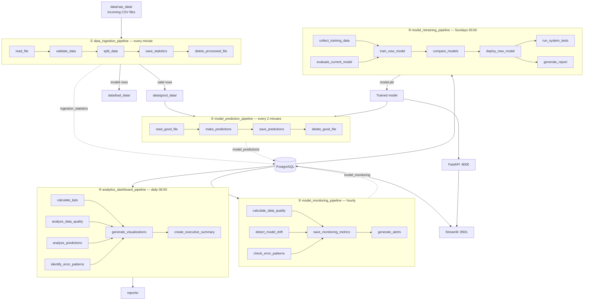

# Flywheel

**A self-sustaining ML system for road accident risk.** Data arrives, gets validated,
scored, monitored for drift, and the model retrains itself on what survived — on a schedule,
without anyone in the loop.


---

## The idea

A model that trains once and is never touched again starts dying the moment it's deployed.
The data drifts, the world changes, and nobody notices until someone complains.

This project is built as a **closed loop** instead. Five Airflow pipelines run on their own
schedules and hand work to each other through the database:

> raw files → validated rows → predictions → drift metrics → a retrained model → back to serving

Each stage writes what it learned to Postgres, which means the next stage — and any human
looking at the dashboard — can see the whole history rather than just the current state.
The loop closes because the retraining pipeline reads the data that the ingestion pipeline
validated, and deploys over the model the prediction pipeline is serving.

The thing being predicted is `accident_risk`: a continuous 0–1 score for how dangerous a
stretch of road is, given its geometry, lighting, weather, and history.

## Architecture



---

## The five pipelines

### ① Ingestion — `data_ingestion_pipeline`, every minute

```
read_file → validate_data → split_data → save_statistics → delete_processed_file
```

Takes the **oldest single file** from `data/raw_data/` and moves it through five tasks. One
file per run, deliberately: it gives every batch its own verdict and its own row in the
statistics table, which is what makes data quality measurable over time instead of a
one-off print statement.

Validation is **row-level, not file-level** — and that distinction matters. Rather than
rejecting a whole file because twelve rows are malformed, the DAG builds a boolean mask of
bad rows and splits the file in two: clean rows go to `data/good_data/` and continue into
the pipeline, bad rows go to `data/bad_data/` and wait for a human. A single corrupt row no
longer costs you the other 450.

Current checks:

| Column | Rule |
|---|---|
| `road_type` | must be one of `highway`, `rural`, `urban` |
| `speed_limit` | must not be negative |

Each run records the filename, total/valid/invalid counts, and a per-column error breakdown
to `ingestion_statistics`. The source file is deleted last, so a crash mid-DAG leaves it in
place to be retried rather than silently losing it.

### ② Prediction — `model_prediction_pipeline`, every 2 minutes

```
read_good_file → make_predictions → save_predictions → delete_good_file
```

Picks up a file the ingestion pipeline cleared, scores every row, and writes batch-level
statistics to `model_predictions` — count, mean, min, and max risk score.

It stores **aggregates per batch rather than one row per prediction**, which keeps the table
small enough to query cheaply while still supporting drift detection downstream. The
per-request audit trail for interactive predictions lives separately, on the API side.

### ③ Monitoring — `model_monitoring_pipeline`, hourly

```
[calculate_data_quality, detect_model_drift, check_error_patterns] → save_monitoring_metrics → generate_alerts
```

Three independent checks run in parallel — they don't depend on each other, so there's no
reason to serialise them — then their results are written together and evaluated for alerts.

Over the last hour it asks:

- **Is incoming data still clean?** Valid-row percentage across recent batches. Below **80%**
  raises a warning.
- **Has the model's output distribution shifted?** Mean, min, max, and standard deviation of
  risk scores. A mean above **0.7** flags as anomalous — either the roads genuinely got more
  dangerous, or something upstream broke. Both are worth knowing.
- **Are errors clustering?** Which columns fail validation most often, which points at the
  producer rather than the pipeline.

Predictions dropping to zero raises its own alert — a silent pipeline is a failure mode that
no accuracy metric will catch.

### ④ Retraining — `model_retraining_pipeline`, Sundays at midnight

```
[collect_training_data, evaluate_current_model] → train_new_model → compare_models → deploy_new_model → [run_system_tests, generate_report]
```

The part that closes the loop. It gathers accumulated good data, scores the model currently
in production for a baseline, trains a challenger, and **only deploys if the challenger
clears a gate**:

```python
should_deploy = new_metrics['test_r2'] > 0.7 or new_metrics['mae'] < 0.05
```

A retraining job that always ships is just an automated way to break production. The
comparison step is what makes this a deployment pipeline rather than a training script on a
timer — and every decision, deploy or skip, is recorded in `model_deployments` with the
metrics that justified it, so model history is auditable.

Deployment is followed by smoke tests and a report, in parallel, since neither blocks the
other.

### ⑤ Analytics — `analytics_dashboard_pipeline`, daily at 06:00

```
[calculate_kpis, analyze_data_quality, analyze_predictions, identify_error_patterns] → generate_visualizations → create_executive_summary
```

Four parallel analyses fan into chart generation and an executive summary written to
`reports/`. KPIs include cumulative files processed, total valid rows, overall quality
percentage, prediction volume, average risk, and the count of high-risk batches.

This pipeline exists because the numbers the other four produce are only useful if somebody
reads them, and "somebody" usually means a non-engineer looking at a chart at 9am.

---

## The model

A `RandomForestRegressor` with one-hot encoded categoricals, wrapped by
`src/api/model_manager.py`, which loads the model and its preprocessor together and exposes
single and batch prediction behind one interface. Metadata — feature list, encoder type,
training timestamp — travels with the artefact in `model/metadata.json`, so the serving code
never has to guess what the model expects.

**13 features**, four of them categorical:

| Type | Features |
|---|---|
| Categorical | `road_type`, `lighting`, `weather`, `time_of_day` |
| Numerical | `num_lanes`, `curvature`, `speed_limit`, `num_reported_accidents` |
| Boolean | `road_signs_present`, `public_road`, `holiday`, `school_season` |

Target: `accident_risk`, continuous on 0–1. Evaluated with R² and MAE — regression rather
than classification, because a ranked risk score is more actionable than a binary
safe/unsafe flag when you're deciding which roads to fix first.

## The API

FastAPI, served by Uvicorn, with Pydantic request validation on every endpoint.

| Method | Endpoint | Purpose |
|---|---|---|
| `GET` | `/health` | Liveness, for orchestration and smoke tests |
| `GET` | `/model-info` | Loaded model version, features, training date |
| `POST` | `/predict` | Score one road segment |
| `POST` | `/predict-batch` | Score many, grouped under one `batch_id` |
| `POST` | `/past-predictions` | Query history, filterable by source and date |
| `GET` | `/predictions/{batch_id}` | Retrieve one batch |

Every prediction is persisted with its input features as `JSONB`, a UUID, a `source` tag
distinguishing `webapp` from `scheduled_job`, and the model version that produced it. The
schema-less feature column is deliberate: model versions change their inputs, and a JSON
column means a new model doesn't require a migration while staying queryable through
Postgres's JSON operators.

Interactive docs at `/docs`.

```bash
curl -X POST http://localhost:8000/predict \
  -H "Content-Type: application/json" \
  -d '{"features": {
        "road_type": "highway", "num_lanes": 3, "curvature": 5,
        "speed_limit": 90, "lighting": "daylight", "weather": "clear",
        "time_of_day": "day", "num_reported_accidents": 0
      }}'
```

## The database

Postgres is the integration point — pipelines don't call each other, they read and write
tables.

| Table | Written by | Holds |
|---|---|---|
| `ingestion_statistics` | ① | Per-file row counts, quality score, validation status |
| `model_predictions` | ② | Per-batch prediction aggregates |
| `model_monitoring` | ③ | Hourly quality and drift metrics |
| `model_deployments` | ④ | Model version history and the metrics behind each decision |
| `system_reports` | ⑤ | Generated analytics reports |
| `predictions` | API | Individual predictions, features as JSONB, UUID, source |
| `data_quality_issues` | API | Per-column validation failures with severity |
| `data_drift` | — | Train vs. serving feature distributions |
| `model_performance` | — | Batch-level prediction statistics |

Declared in `src/database/schema.sql`, with SQLAlchemy models and CRUD helpers in
`src/database/`.

## Project structure

```
.
├── dags/                        # Airflow DAGs — the five pipelines
│   ├── data_ingestion_dag.py
│   ├── model_prediction_dag.py
│   ├── model_monitoring_dag.py
│   ├── model_retraining_dag.py
│   └── analytics_dashboard_dag.py
├── src/
│   ├── api/
│   │   ├── main.py              # FastAPI app and routes
│   │   ├── schemas.py           # Pydantic request/response models
│   │   ├── model_manager.py     # Model + preprocessor loading, inference
│   │   └── run_api.py
│   └── database/
│       ├── models.py            # SQLAlchemy ORM models
│       ├── crud.py              # Query helpers
│       ├── config.py            # Connection handling
│       └── schema.sql           # DDL
├── scripts/
│   ├── train_model.py           # Training entrypoint
│   ├── init_database.py         # Schema bootstrap
│   ├── split_dataset.py         # Slice the dataset into ingestable files
│   ├── generate_errors.py       # Inject known-bad data to test validation
│   ├── test_api.py              # API smoke tests
│   └── verify_database.py       # Schema/connection checks
├── model/
│   ├── metadata.json            # Feature list, encoder, training timestamp
│   └── model.pkl
├── data/
│   ├── raw_data/                # Drop folder for incoming files
│   ├── good_data/               # Validated rows, awaiting prediction
│   ├── bad_data/                # Quarantined rows
│   └── predictions/
├── streamlit_app.py             # Monitoring dashboard
├── reports/                     # Generated analytics output
└── airflow/                     # Airflow home
```

## Testing the validation layer

A pipeline that catches bad data is only trustworthy once you've watched it catch bad data.
`scripts/generate_errors.py` takes the clean dataset and produces copies with deliberate,
known corruption — unknown categories, negative speed limits, type violations — so the
quarantine path can be proven rather than assumed.

`scripts/split_dataset.py` does the mundane counterpart: chops one large CSV into many small
files so there's a realistic stream of arrivals for the ingestion DAG to consume.

## Running it

**Prerequisites:** Python 3.12, PostgreSQL running locally.

```bash
# 1. Install
pip install -r requirements.txt

# 2. Create the database and schema
createdb ml_production
python scripts/init_database.py
python scripts/verify_database.py

# 3. Train an initial model
python scripts/train_model.py

# 4. Generate a stream of files to ingest
python scripts/split_dataset.py
```

Then start the three services:

```bash
# API
uvicorn src.api.main:app --host 0.0.0.0 --port 8000 --reload

# Airflow (enable all five DAGs in the UI)
export AIRFLOW_HOME=$(pwd)/airflow
airflow standalone

# Dashboard
streamlit run streamlit_app.py
```

| Service | URL |
|---|---|
| API docs | http://localhost:8000/docs |
| Airflow | http://localhost:8080 |
| Dashboard | http://localhost:8501 |

## Current state

The five pipelines are implemented and run. Known gaps, tracked honestly:

- **Paths and connection strings are hardcoded** to a single development machine
  (`/Users/.../ml-production-system`, `postgresql://...@localhost/ml_production`) in all five
  DAGs. These need to move to environment variables or an Airflow connection before the
  project runs anywhere else — this is the main barrier to reproducing it.
- **Two table sets have drifted apart.** The DAGs write to `model_predictions`,
  `model_monitoring`, `model_deployments`, and `system_reports`; `schema.sql` declares
  `predictions`, `data_quality_issues`, `data_drift`, and `model_performance`. Only
  `ingestion_statistics` is common to both. The DAG tables need adding to the schema so a
  fresh install works end to end.
- **`id` is in the model's feature list.** A surrogate row identifier carries no signal and
  invites the forest to memorise it. It should be dropped from `feature_columns`.
- **Validation covers two columns.** `road_type` and `speed_limit` are checked; `curvature`,
  `num_lanes`, `lighting`, `weather`, and the boolean flags are not yet.
- **Drift detection is threshold-based**, comparing recent means against fixed cutoffs rather
  than testing recent distributions against the training distribution. The `data_drift` table
  is already shaped for the latter (train vs. serving mean and std) — it just isn't populated
  yet.
- **No CI.** There's no `.github/workflows/`, so nothing runs automatically on push.
- **`data/raw_data/` is committed** — ~10,000 generated CSVs. These are reproducible from
  `split_dataset.py` and should be gitignored.

## Roadmap

- [ ] Move all paths and connection strings into environment variables
- [ ] Reconcile `schema.sql` with the tables the DAGs actually write
- [ ] Drop `id` from the feature set and retrain
- [ ] Extend validation to every column, with per-column severity
- [ ] Populate `data_drift` with real train-vs-serving distribution tests (PSI or KS)
- [ ] GitHub Actions: lint, test, and build on every push
- [ ] Containerise the full stack with Docker Compose
- [ ] Gitignore generated data

## License

MIT
