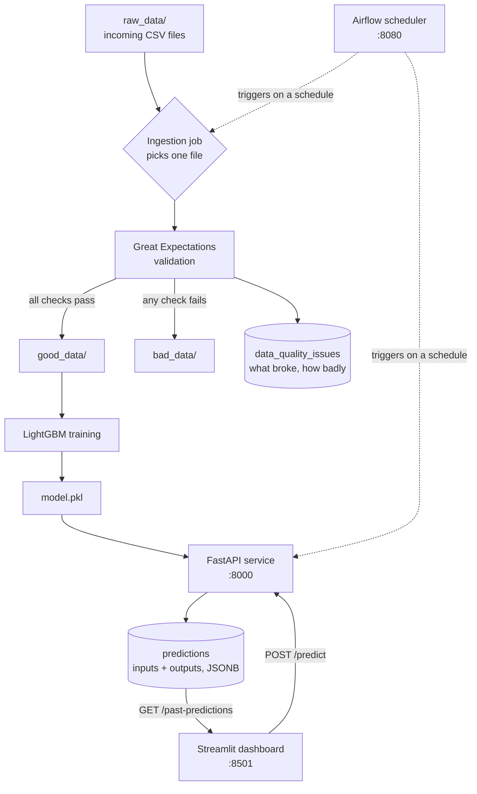

# Road Accident Risk — Data Ingestion & Training Pipelines

An end-to-end machine learning system that predicts how dangerous a stretch of road is,
built around the assumption that real data arrives continuously and arrives dirty.

---

## What problem this solves

Most ML tutorials hand you a clean CSV, train a model, and stop. Production doesn't work
that way. Data shows up in batches over time, some of those batches are broken, and once a
model is live you need to know what it was asked and what it answered — often months later,
when someone questions a decision it made.

This project is built around those three realities:

1. **Data arrives in pieces, not all at once.** Files land in a drop folder and get picked
   up one at a time.
2. **Some of those pieces are bad.** Every file is validated before it's allowed anywhere
   near the model, and failures are quarantined rather than silently averaged into the
   training set.
3. **Predictions need to be auditable.** Every API call is persisted with its inputs and
   its output, so the system's history is queryable.

The model itself predicts `accident_risk` — a continuous score from 0 to 1 — from road
geometry and conditions: road type, curvature, speed limit, lighting, and weather.

## How the data flows



### Stage 1 — Ingestion picks up one file at a time

`model/scripts/data_ingestion.py` looks at the `raw_data/` folder, picks a single CSV at
random, and processes only that one. This is deliberate. Processing the whole folder at
once would hide exactly the failure mode the project is designed to expose: what happens
when *one* batch out of fifty is malformed. Running file-by-file means each batch gets its
own verdict and its own row in the quality log.

### Stage 2 — Validation decides if the file is trustworthy

The file is wrapped in a Great Expectations `PandasDataset` and put through a set of
declarative checks — is this column ever null, does this numeric column stay inside a
plausible range, do the categorical values belong to the set we expect. Each failed
expectation becomes an entry in an issue list.

That list is then turned into a severity rating:

| Failed checks | Criticality |
|---|---|
| 0 | `none` |
| 1–5 | `medium` |
| more than 5 | `high` |

The point of the severity tier is that not every problem deserves the same reaction. A file
with one out-of-range value is a different situation from a file where the schema has
drifted entirely, and a downstream alerting rule needs to be able to tell them apart.

### Stage 3 — Files are routed, not deleted

Based on the verdict, the file is physically moved:

- **Clean** → `good_data/`, where training can pick it up
- **Dirty** → `bad_data/`, where it sits untouched for a human to inspect

Nothing is thrown away. A bad file is evidence about an upstream producer, and you usually
want to look at it rather than lose it.

### Stage 4 — Every validation run is recorded

Regardless of outcome, a row goes into the `data_quality_issues` table: the filename, total
row count, valid and invalid counts, a summary of what went wrong, and the criticality.

This is what turns data quality from a one-off print statement into something measurable.
Because it's in Postgres, you can ask real questions of it — *is the failure rate rising?
did it spike after last Tuesday? which producer sends us the most broken files?* — none of
which are answerable if validation results only ever go to a log file.

### Stage 5 — Training

`model/model_training.ipynb` reads the dataset, one-hot encodes the three categorical
columns, and fits a LightGBM regressor.

```python
LGBMRegressor(
    objective="regression",
    boosting_type="gbdt",
    n_estimators=500,
    learning_rate=0.05,
    num_leaves=31,
)
```

An 80/20 train/test split is evaluated with mean squared error. Because `accident_risk` is
a continuous score rather than a crash/no-crash label, this is a regression problem, not
classification — the output is a degree of risk, which is more useful for ranking road
segments than a binary flag would be.

Encoding expands `road_type`, `lighting`, and `weather` into nine binary columns, which
join `speed_limit` and `curvature` for **11 input features**:

```
road_type_highway   road_type_rural   road_type_urban
lighting_daylight   lighting_dim      lighting_night
weather_clear       weather_foggy     weather_rainy
speed_limit         curvature
```

The fitted model is serialised to `model/model.pkl`.

### Stage 6 — Serving, with a paper trail

`api/main.py` loads the pickled model once at startup and exposes two endpoints.

**`POST /predict`** takes the 11 encoded features, validated by a Pydantic schema so
malformed requests are rejected before they reach the model. It runs the prediction, and
then — before returning — writes a row to the `predictions` table containing the model name,
the full input feature set, and the result.

Inputs and outputs are stored as `JSONB` rather than fixed columns. That's a deliberate
choice: the feature set will change as the model evolves, and a schema-less column means a
new model version doesn't require a migration, while the data stays queryable through
Postgres's JSON operators.

**`GET /past-predictions`** returns the 20 most recent predictions, newest first — the read
side of that audit trail.

### Stage 7 — The dashboard

`streamlit/app.py` is the human interface. The sidebar exposes each road feature as a
numeric input; submitting posts to `/predict` and displays the returned risk score. Below
that, the page pulls `/past-predictions` and renders the history as a table.

It's a thin client by design — all logic lives in the API, so the dashboard and any other
consumer see identical behaviour.

## Where the pieces live

Five services share a Docker network:

| Service | Role | Port |
|---|---|---|
| `postgres` | Quality log + prediction log | 5432 |
| `api` | FastAPI prediction service | 8000 |
| `streamlit` | Dashboard | 8501 |
| `airflow` | Scheduling ingestion and prediction jobs | 8080 |
| `model_service` | Training environment, run on demand | — |

`model_service` has `restart: "no"` because training isn't a long-running server — it's a
job you invoke, not a process you keep alive.

## The database

Two tables, created on first boot from `model/scripts/db.sql`:

```sql
CREATE TABLE data_quality_issues (
    id              SERIAL PRIMARY KEY,
    filename        TEXT,
    nb_rows         INT,
    nb_valid_rows   INT,
    nb_invalid_rows INT,
    issue_summary   TEXT,
    criticality     TEXT,          -- none | medium | high
    timestamp       TIMESTAMP DEFAULT NOW()
);

CREATE TABLE predictions (
    id                SERIAL PRIMARY KEY,
    model_name        TEXT,
    input_features    JSONB,
    prediction_result JSONB,
    created_at        TIMESTAMP DEFAULT NOW()
);
```

They answer two different questions. `data_quality_issues` answers *can we trust what's
coming in?* `predictions` answers *what has the model been doing?* Together they cover both
ends of the pipeline.

## The dataset

`raw_data/train.csv` — roughly 518,000 road segments.

| Column | Values | Meaning |
|---|---|---|
| `road_type` | urban, rural, highway | Segment classification |
| `num_lanes` | int | Lane count |
| `curvature` | 0–1 | How sharply the road bends |
| `speed_limit` | int | Posted limit |
| `lighting` | daylight, dim, night | Visibility conditions |
| `weather` | clear, rainy, foggy | Conditions at observation |
| `road_signs_present` | bool | Signage present |
| `public_road` | bool | Public vs. private |
| `time_of_day` | morning … night | Time bucket |
| `holiday` | bool | Public holiday |
| `school_season` | bool | School term active |
| `num_reported_accidents` | int | Historical count |
| `accident_risk` | 0–1 | **Target** |

Only 5 of these 13 inputs currently feed the model. The remaining ones — time of day,
holiday, school season, signage, historical accident count — are available and unused, which
is the most obvious place to improve accuracy next.

## Testing the validation layer

A pipeline that catches bad data is only trustworthy if you've watched it catch bad data.
`model/scripts/error_gen.py` exists for that: it takes the clean dataset and produces copies
with deliberate, known corruption injected — out-of-range numbers, categories that were
never in the training set, strings in numeric columns.

Feeding those through ingestion proves the quarantine actually works, instead of assuming it
does because nothing has failed yet.

`model/scripts/split_dataset.py` does the mundane counterpart: chops the single large CSV
into N smaller files so there's a realistic stream of arrivals to consume.

## Running it

```bash
cp .env.example .env        # fill in passwords and a Fernet key
docker compose up --build
```

Then prepare a stream of files and run a single ingestion pass:

```bash
python model/scripts/split_dataset.py raw_data/train.csv
python model/scripts/data_ingestion.py
```

Dashboard at `localhost:8501`, API docs at `localhost:8000/docs`, Airflow at
`localhost:8080`.

## Current state

The architecture above is what the system is built to do. Not all of it is wired up yet:

- **The Airflow DAGs aren't written.** The scheduler runs and its volumes are mounted, but
  `airflow/dags/` is empty — ingestion is invoked manually today. This is the main gap
  between the diagram and reality.
- **Validation rules point at an older schema.** `data_ingestion.py` still checks `Age`,
  `Country`, and `Salary` from an earlier version of the project; they need rewriting against
  the road-safety columns.
- **Two API files exist.** `api/main.py` is the real one; the root `main.py` is a stub that
  returns a fixed value and should be deleted. The Streamlit client still targets the stub's
  feature names.
- **Paths and hosts are hardcoded** to a developer's machine and to `localhost`, which won't
  resolve between containers.
- **Training lives in a notebook** and needs extracting into a callable script before a DAG
  can run it.

## Next

- [ ] Write the ingestion and prediction DAGs
- [ ] Rewrite expectations for the road-safety schema
- [ ] Extract `train.py` from the notebook, with logged metrics per run
- [ ] Feed the eight unused columns into the model
- [ ] Move connection strings and paths into environment variables
- [ ] Retrain automatically as `good_data/` grows
- [ ] Surface data quality trends in the dashboard

## License

MIT
